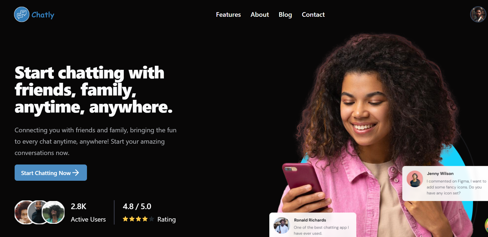

# CHATLY 💬

A chat application that helps to connect you with friends and family.

## Reason For Project
I wanted to learn how websockets work, so why not build a chat app? Initially, I planned on building a mobile app but abandoned the project for about 4 months due to my final year project. Right now, I am focused on completing the web app and then hosting it. Afterwards, I want to shift my focus to mobile development with React Native.

## Design File
Preview the Figma design I used [here](https://www.figma.com/design/jZ69GqMP9gfza5jgGjn0Fq/Chat-Web-UI-Kit-(Community)) 🎨

## Features
1. Private 1-1 messaging 🗣️
2. Group Chats 👥
3. Live Video Chats 📹
4. Real-Time Messaging / Updates 💬
5. Image, Video / Audio Uploads 📷🎥🎵
6. Light or Dark Mode 🌞🌜
7. Custom Chat Wallpapers 🖼️
8. Discover Users 🔍

### Interface Preview
1. Chat Interface

2. Discover Users

3. Video Chat

4. Custom Wallpaper Selection

5. Landing Page

## Tech Stack

### Front End (Web)
- React ⚛️
- Tailwind CSS 🌬️
- Shadcn UI 🖌️
- Clerk 🔑
- Zustand 🐻
- Tanstack Query 🔍
- React Router Dom 🛤️
- Live Kit 🎥

### Back End
- Node 🟢
- TypeScript 🔷
- Socket.IO 🟠
- Prisma 🛠️
- MongoDB 🍃
- Express 🚂

## Installation Steps
1. [Frontend](https://github.com/Nathan-Somto/Chatly/tree/main/frontend) 
2. [Backend](https://github.com/Nathan-Somto/Chatly/tree/main/backend) 

### Contributing
I appreciate any form of contributions or feature requests. If you are interested, just contact me so that I can have an idea of what you are doing. 🤝